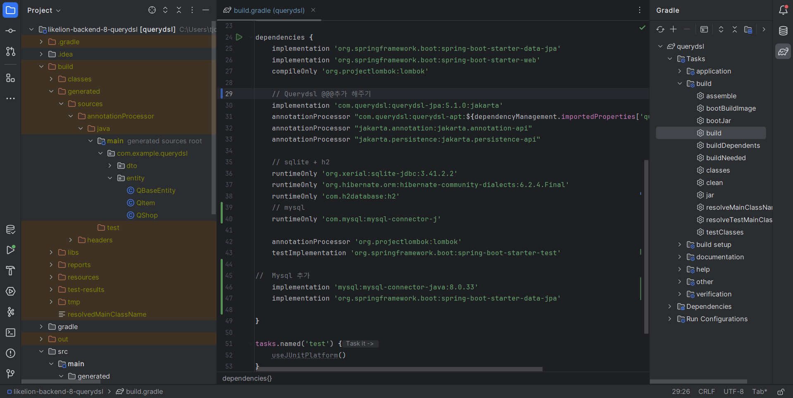
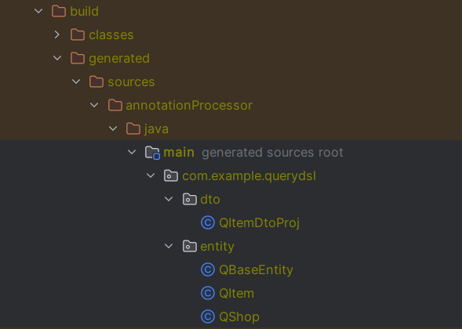

## 📝Querydsl 
QueryDSL이란 SQL, JPQL 등을 코드로 작성할 수 있도록 해주는 빌더 오픈소스 프레임워크이다.
<hr>

#### Querydsl을 사용해야 하는 이유
1. Querydsl은 Java코드를 기반으로 동작한다
2. Java코드로 동작하기 때문에 컴파일 단계에서 오류를 발견 할 수 있다
3. 인텔리제이와 같은 IDE의 자동 완성 기능의 도움을 받을 수 있다
4. 복잡한 쿼리 및 동적 쿼리를 만드는데 유용하다
<hr>

#### QClass
1. JPA_APT가 @Enttiy 와 같은 특정 어노테이션을 찾고 해당 클래스를 분석해서 QClass를 만들어 준다
2. 엔티티 클래스의 메타 정보를 담고 있는 클래스로, Querydsl은 타입 안정성(Type safe)을 보장하면서 쿼리를 작성할 수 있게 된다
- QClass 생성 방법
 1.  `build.gradle`에 Querydsl 의존성 추가 + build해주기
 2.  만들어 놓은 Entity 클래스를 바탕으로 `build/main`에 QClass가 생성된 것을 볼 수 있다
- 
 <hr>
 
#### 프로젝션(Projection)
1. select절의 대상을 지정하는 것
2. 프로젝션 대상이 두개 이상이라면 `튜플(Tuple)`이나 `DTO`로 조회해야한다.
<hr>

#### 튜플(Tuple) 사용하기
1. Querydsl에서 제공하는 Tuple 타입은 `repository 계층까지만 사용을 권장`한다
2. Service나 Controller계층에 이용시 DTO사용
3. `com.querydsl.core.Tuple`을 사용
```
// projection이 두 개 이상이라면 튜플로 조회
    Tuple result = queryFactory
            // 집계하고 싶은 속성의 집계함수 메서드를 호출하여 select에 추가
            // item.(속성).(집계함수)()
            .select(
                    item.count(),
                    item.price.avg(),
                    item.price.max(),
                    item.stock.sum()
            )
            .from(item)
            .fetchOne();
```
  <hr>

#### DTO 사용하기
DTO접근 방법 3가지 <br>
- 프로퍼티 접근
  - 사용하는 Dto에 @Setter를 추가 해준다
  ```java
  itemDtoList = queryFactory
            // Projections.bean : Setter기반 Projection / ItemDto에 @Setter가 없을경우 null반환
            .select(Projections.bean(
                    ItemDto.class,
                    item.name,
                    item.price,
                    item.stock
            ))
            .from(item)
            .where(item.name.isNotNull())
            .fetch();
    itemDtoList.forEach(System.out::println);
  ```
  - 단점 - Dto의 필드 값이 id와 같은 값에는 setter가 필요하지 않을 수도 있다는 단점이 있다
  
- 필드 직접 접근
  - Dto에 @Setter없이 바로 사용이 가능하다
  ```java
    itemDtoList = queryFactory
    // Projections.fields: 속성 기반 Projection / ItemDto에 @Setter없이 사용 가능
            .select(Projections.fields(
                    ItemDto.class,
                    item.name,
                    item.price,
                    item.stock
            ))
            .from(item)
            .where(item.name.isNotNull())
            .fetch();
    itemDtoList.forEach(System.out::println);
  ```
  
- 생성자 사용
  - @AllArgsConstructor가 필요하다
  ```java
    itemDtoList = queryFactory
   // Projections.constructor : 생성자 기반 Projection / @AllArgsConstructor 필요
            .select(Projections.constructor(
                    ItemDto.class,
                    item.name,
                    item.price,
                    item.stock
            ))
            .from(item)
            .where(
                    item.price.isNotNull(),
                    item.stock.isNotNull()
                    )
            .fetch();
    itemDtoList.forEach(System.out::println);
  ```
<hr>

#### @QueryProjection
  - DTO 생성자에 @QueryProjection을 붙여주면 DTO도 Q파일로 생성이 가능하다
  - Querydsl과 DTO의 결합력(Coupling)이 강해진다
  - 단점 - Querydsl에 대한 의존도가 높아진다
  ```java
  public class ItemDtoProj {
    private String name;
    private Integer price;
    private Integer stock;

    // QDto를 만들고, 그 생성자를 사용해 데이터를
    // Projection 할 수 있다.
    @QueryProjection
    public ItemDtoProj(
            String name,
            Integer price,
            Integer stock
    ) {
        this.name = name;
        this.price = price;
        this.stock = stock;
    }
}
  ```
  

  - #### @QueryProjection 사용하기
  ```java
  List<ItemDtoProj> itemDtoProjList = queryFactory
            // 만들어진 QDto의 생성자를 호출함으로써, 결과를 Dto로 받을 수 있다.
            .select(new QItemDtoProj(
                    // 타입 순서 주의
                    item.name,
                    item.price,
                    item.stock
            ))
            .from(item)
            .where(item.name.isNotNull())
            .fetch();
    itemDtoProjList.forEach(System.out::println);
  ```
<hr>

## 환경 변수 설정 방법 👇
[여기를 눌러 주세요](https://github.com/mad-cost/Querydsl-prac/blob/master/md/querydsl.md "Click")
